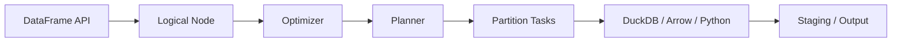
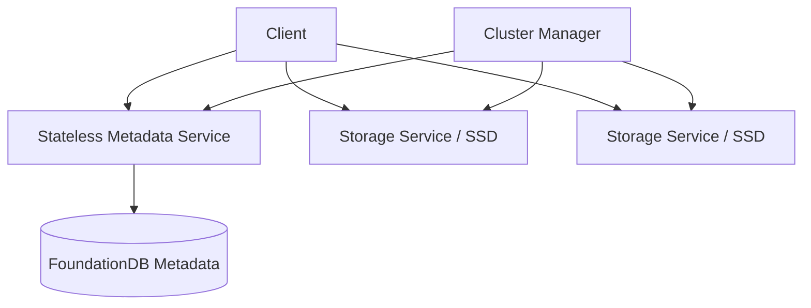

# smallpond、3FS 与 LLM 工作负载如何连接

smallpond 和 3FS 不应该被理解为“DeepSeek 版 Spark + HDFS”的简单替换组合。更准确的学习方式，是先从 LLM 训练
工作负载出发，再判断计算层、存储层、训练框架和数据治理分别需要承担什么责任。

## 第一性原理：模型消费的是有顺序的数据

传统数仓通常围绕行、表、分区和指标交付。LLM 训练最终消费的是有顺序、有边界、有目标函数的 Token Sequence：


因此，“数据处理任务成功”只覆盖了链路的一部分。AI 数据工程还要回答：

- Tokenizer 和 Packing 是否改变了有效训练信息？
- 每个 Sample、Sequence、Shard 能否追溯到来源和处理版本？
- 数据供给是否让训练设备等待？
- Checkpoint 是否能绑定正确的数据游标和运行版本？
- 数据变化是否在固定评测和训练预算下影响模型结果？

## DeepSeek-V3 报告定义了什么工作负载

[DeepSeek-V3 Technical Report](https://arxiv.org/html/2412.19437) 把算法、训练框架和硬件放在同一个系统中讨论。与数据工程
最相关的公开事实包括：

- 预训练语料为 14.8T Token，并强调减少冗余同时保留多样性；
- 使用文档 Packing，在预处理阶段以 0.1 比例应用 PSM 形式的 FIM；
- 使用 128K 词表的 Byte-level BPE，并为多语言压缩效率调整 Pretokenizer 和训练数据；
- 预训练最大 Sequence Length 为 4K；
- 训练采用 16-way PP、跨 8 节点的 64-way EP 和 ZeRO-1 DP；
- 节点内使用 NVLink/NVSwitch，节点间使用 InfiniBand。

这些事实共同说明：数据格式、Sequence 组织、批次调度、专家路由、通信拓扑和存储访问不是互相独立的优化问题。
不过，技术报告没有公开完整数据 Pipeline，也不能单凭报告推断 smallpond 或某个公开 3FS 提交就是 V3 训练的精确生产版本。

## smallpond：把批量计算拆成计划、分区和任务

[smallpond 固定提交 `52ecc5e`](https://github.com/deepseek-ai/smallpond/tree/52ecc5e45535c7448f848bcb45b0da00d9484f81)
的公开实现展示了一条清晰的职责链：



`DataFrame` 先包装逻辑 `Node`。`compute`、`write_parquet` 等 Action 触发优化和规划，`Planner` 再按 Partition 生成
`Task`。单个任务可以使用 DuckDB、Arrow 或 Python 处理数据；Ray 路径或 Scheduler/Executor 路径负责运行任务；
共享 data root 保存计划、日志、中间产物、输出和完成状态。

这里最值得传统数据工程师学习的不是 API 语法，而是三个边界：

1. **SQL 与分布式执行分离**：SQL 能表达 Join，不代表两侧数据已经按兼容方式分区；
2. **强单机引擎与轻分布式编排组合**：尽量把单 Task 的列式计算交给 DuckDB，再显式处理跨 Partition 边界；
3. **中间物化是协议**：它带来 I/O 成本，也为重试、复用、检查点和故障诊断提供证据。

smallpond 不自动判断训练数据是否高质量，也不定义 Tokenizer、Dataset Manifest、评测污染或模型指标。它可以执行这些
加工逻辑，但语义和治理责任仍属于数据 Pipeline。

## 3FS：把共享文件存储变成 AI 数据平面

[3FS 固定提交 `22fca04`](https://github.com/deepseek-ai/3FS/tree/22fca04564c7cc230fd8b9523b8b92864e1dad47)
的设计将系统分为 Cluster Manager、Metadata Service、Storage Service 和 Client：



元数据和文件数据走不同路径：

- Metadata Service 使用 FoundationDB 事务维护 inode、目录项和文件布局，因此服务本身可以无状态扩展和故障切换；
- Client 打开文件后获得布局信息，可以计算 Chunk ID 和对应 Chain，减少 Metadata Service 进入数据关键路径的次数；
- Storage Service 管理本地 SSD 上的 Chunk，使用 CRAQ 复制链提供强一致语义；
- FUSE 提供低迁移成本，USRBIO 为性能敏感的小块随机 I/O 提供异步、批量和零拷贝接口。

3FS 官方材料明确面向四类 AI 工作负载：数据准备中间产物、DataLoader 随机访问、并行 Checkpoint 和推理 KVCache。
它的价值不是替训练程序决定样本顺序，而是让多个计算节点通过统一命名空间访问聚合的 SSD 与网络带宽。

## 四层系统边界

| 层次 | 主要问题 | 典型产物或指标 | 不应越界替代 |
| --- | --- | --- | --- |
| 数据治理与 Pipeline | 什么数据可以训练、如何版本化 | Dataset Manifest、质量报告、Sample 血缘 | 不能交给文件系统自动决定 |
| smallpond 类计算层 | 如何扩展清洗、Join、Shuffle 和物化 | Logical Plan、Task、Partition、重试 | 不定义模型质量结论 |
| 3FS 类存储层 | 如何承载共享随机读和并行写 | 文件布局、P99、吞吐、恢复状态 | 不替代 Catalog、Schema、许可和血缘 |
| DataLoader 与训练框架 | 如何把 Sequence 持续送入模型 | Batch Wait、Tokens/s、Loss、Checkpoint | 不自动修复上游数据质量 |

任何一层都不能独立交付“高质量模型数据”。完整责任链必须把四层的版本和指标连接起来。

## 映射到本地项目

当前 Mini-LLM Data Factory 已经实现最小的语义闭环：

| 本地模块 | 已实现证据 | 对应的上游启发 | 后续阶段 |
| --- | --- | --- | --- |
| `pipeline.py` | Tokenizer、Packing、Dataset Manifest | DeepSeek-V3 数据构造 | Lab 04/05 |
| `training.py` | DataLoader、Loss、Checkpoint、Run Manifest | 训练框架消费数据版本 | Lab 07/08 |
| `experiment.py` | 固定预算的数据 A/B | 数据变化必须由模型反馈验证 | Lab 04/10 |
| 尚未实现的分布式计算 | 无集群实验证据 | smallpond Plan/Partition/Task | Lab 06 |
| 尚未实现的共享存储 | macOS 不具备 3FS 原生证据 | 3FS I/O 工作负载和文件语义 | Lab 09 |

这意味着未来替换执行引擎或存储介质时，Manifest 不应该消失。相反，它需要继续绑定：

```text
Source Version
→ Rule / Code Version
→ Tokenizer / Packing / Shard
→ Physical Artifact and Storage Location
→ Training Run / Checkpoint
→ Eval Result
```

## 传统数据工程经验如何迁移

| 传统经验 | 可直接迁移的能力 | 必须新增的视角 |
| --- | --- | --- |
| SQL 执行计划 | 理解算子、Join、过滤和物化 | Partition 兼容、Token 有效性和模型反馈 |
| 数仓分区 | 控制扫描范围和任务并发 | Shard 分布、样本顺序和训练消费 |
| HDFS/对象存储 | 理解吞吐、文件大小和一致性 | 随机样本读、Checkpoint 并行写、DataLoader Wait |
| 数据质量 | 规则、审计和异常样例 | 近似重复、评测污染、许可、PII 和 Loss 归因 |
| 数据血缘 | 追踪来源表和任务 | 追踪到 Token、Sequence、Run、Checkpoint 和模型版本 |

## 选型顺序

一个稳健的 AI 数据工程演进顺序是：

1. 先用单机链路证明数据契约、质量和模型反馈闭环；
2. 数据量超过单机边界后，用 DuckDB/Parquet 建立基线；
3. 出现真实 Partition、Shuffle、倾斜或恢复问题后，再引入 smallpond 类分布式计算；
4. 证明 DataLoader 或 Checkpoint 的存储瓶颈后，再评估 3FS 类共享数据平面；
5. 只有在 Linux、NVMe、RDMA 和多节点条件满足时，才把 3FS 集群结果标为自己的实验。

这条顺序符合 KISS 和 YAGNI：先保住可验证的数据—模型主线，再用真实瓶颈决定系统复杂度。

