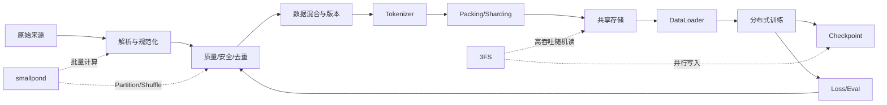

# AI 数据工程知识地图

AI 数据工程不是在传统 ETL 上增加一个 LLM API。它把数据系统的责任边界从“正确交付表”扩展为“持续交付可训练、可追溯、能改善模型的数据”。

这张地图面向已经工作的数据开发和建模工程师。它不要求从计算机基础重新学起，而是先识别已有能力，
再补上训练数据语义、模型反馈和 AI 基础设施三个断层。

## 项目所在的位置

```text
AI 应用工程：Prompt、RAG、Agent、Workflow、业务产品
                         ▲
                         │ 消费模型与数据能力
                         │
AI 数据工程：训练/评测数据、数据计算、DataLoader、存储、血缘与反馈闭环  ← 本项目
                         │
                         ▼ 为模型持续供给数据
模型与 AI Infra：训练算法、分布式训练、通信、Kernel、硬件
```

项目会使用 LLM 做分类、辅助标注或质量评估，也会训练 Tiny LLM 建立反馈，但不会把 Agent 编排当作主线。
我们的主问题始终是：数据如何被构造、供给、消费、评估和改进？

## 端到端知识链



学习时始终沿箭头追问：上游产物如何成为下游输入？版本、顺序和语义有没有丢失？

## 六层能力结构

### 1. LLM 数据语义

需要掌握：

- Document、Sample、Conversation、Episode；
- Token、Vocabulary、Special Token；
- Sequence、Batch、Mask、Label；
- 预训练、SFT、偏好数据、强化学习数据；
- Next Token Prediction、FIM、Document Packing。

核心问题：模型实际消费的不是“行”，而是具有顺序、边界和训练目标的 Token 序列。

### 2. 训练数据工程

需要掌握：

- 多格式解析、Unicode 和内容规范化；
- 精确去重、MinHash/LSH 近似去重；
- 语言、领域、质量、安全、PII 和版权；
- 数据混合、权重采样和课程学习；
- Tokenization、Packing、Sharding；
- Dataset Manifest、Dataset Card 和样本血缘。

核心问题：结构正确不等于对模型有效。

### 3. 数据计算引擎

需要掌握：

- Parquet、Arrow、列式存储；
- DuckDB 向量化执行；
- Lazy DAG、逻辑计划和算子融合；
- Partition、Shuffle、Join 和数据倾斜；
- Ray 调度、任务重试和推测执行；
- smallpond 如何利用共享文件系统物化中间结果。

核心问题：如何在保持简单边界的同时扩展数据加工吞吐。

### 4. AI 存储与 I/O

需要掌握：

- 文件语义、对象存储和表格式的边界；
- 元数据服务、Inode、Directory Entry；
- Chunk、Stripe、Replica、CRAQ；
- NVMe、NUMA、RDMA、InfiniBand/RoCE；
- FUSE、原生客户端、零拷贝；
- 随机样本读取、并行 Checkpoint 和 KV Cache。

核心问题：存储不是静态容量，而是 GPU 数据供给系统的一部分。

### 5. 训练系统

需要掌握：

- Dataset/DataLoader；
- Global Batch、Micro Batch 和梯度累积；
- DP、TP、PP、EP、ZeRO；
- MoE All-to-All；
- Checkpoint 与随机状态恢复；
- Tokens/s、DataLoader Wait 和 GPU 利用率。

核心问题：不需要先写 CUDA Kernel，但必须理解数据如何限制训练。

### 6. 数据—模型反馈与治理

需要掌握：

- 固定训练预算的数据版本 A/B；
- 分领域 Loss 和能力评测；
- 评测污染与数据泄漏；
- 数据归因、失败样例回流；
- 来源许可、删除请求和版本废止；
- 成本、质量和吞吐的联合决策。

核心问题：数据质量最终要通过模型和业务评测闭环，而不只是规则通过率。

## 传统能力迁移矩阵

| 传统数据工程能力 | 可直接迁移 | 需要升级的部分 |
| --- | --- | --- |
| 数仓分层 | 原始、规范、服务层边界 | 增加训练候选、Token、Packed Sequence 层 |
| SQL/ETL | 批处理、Join、聚合、调度 | 多格式解析、模型过滤、Tokenization |
| 分区设计 | 并行度、裁剪、倾斜处理 | Shard、随机访问、训练 Rank 分配 |
| 数据质量 | 完整性、唯一性、及时性 | 语义质量、近似重复、污染、可训练性 |
| 数据血缘 | 表级、字段级依赖 | Sample/Token 到来源、规则、Tokenizer、模型 |
| SLA | 成功率、时效、资源 | Tokens/s、DataLoader Wait、Checkpoint 恢复 |
| 数据治理 | 权限、口径、生命周期 | 许可、PII、数据删除与模型版本影响 |

## 职业能力进阶

能力不是按工具数量分级，而是按能够独立承担的责任分级：

| 阶段 | 能够承担的责任 | 可验证证据 |
| --- | --- | --- |
| L0 传统数据交付 | 交付表、任务和指标 | SQL、模型设计、任务 SLA |
| L1 AI 数据语义 | 交付可训练的 Token Sequence | Tokenizer、Packing、Dataset Manifest |
| L2 数据质量闭环 | 用受控实验验证数据版本 | 质量报告、污染检测、数据 A/B |
| L3 规模与供给 | 诊断计算、Shard 和 DataLoader 瓶颈 | 执行 Profile、Tokens/s、等待比例 |
| L4 系统协同 | 连接数据、训练、Checkpoint 和存储 | Run Manifest、恢复实验、I/O 报告 |
| L5 AI 数据负责人 | 用模型失败驱动下一版数据 | 归因报告、版本决策、独立复现 |

自主节奏主线的目标是达到 L4，并用一个完整毕业项目证明正在向 L5 迁移。它不是职级承诺，
而是一套检查自己是否真正跨过“只会写 SQL”边界的能力证据。

## 指标树

```text
数据有效性
├── 文档保留率、去重率、过滤原因
├── 有效 Token 产出率
├── 领域/语言/难度分布
└── 评测污染率

训练可用性
├── Packing 利用率
├── Shard 大小与倾斜
├── DataLoader 等待比例
├── Tokens/s/GPU
└── Checkpoint 写入与恢复时间

模型结果
├── Train/Validation Loss
├── 分领域评测
├── 数据版本 A/B 差异
└── 安全、事实性与业务指标
```

前两组指标解释数据和系统，最后一组才回答数据是否真正改善模型。三组不能相互替代。

## DeepSeek 学习锚点

- smallpond：数据计算层，重点学习单机执行引擎、显式分区和共享存储的组合；
- 3FS：共享存储层，重点学习 AI 工作负载、强一致文件语义和高性能 I/O；
- DeepSeek-V3 报告：模型与训练层，重点学习数据构造、Document Packing、训练并行和基础设施协同。

项目不会假设这三者构成 DeepSeek 的全部内部数据平台。它们是理解系统协同设计的公开锚点。

默认学习深度遵循“工作负载 → 使用 → 设计 → 实现”四级：

- 所有人必须理解工作负载和边界；
- 主线要求完成一次可运行实验或受控设计推演；
- smallpond Planner、3FS 部署和分布式训练实现属于条件允许时的进阶支线；
- 不因为项目开源就默认它适合替换团队现有的 Spark、对象存储或湖仓系统。
